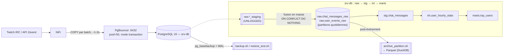

# Couche base de données Zevent


🇫🇷 Français | 🇬🇧 [English](README.md)

Couche PostgreSQL uniquement (section 2️⃣ du document d'architecture —
stockage, partitionnement, PgBouncer, tuning, archivage). L'extraction/NiFi
et le monitoring/Prometheus sont hors périmètre ici.

## Table des matières

- [Architecture](#architecture)
- [Fichiers](#fichiers)
- [Dimensionnement de la capacité (référence Zevent 2025)](#dimensionnement-de-la-capacité-référence-zevent-2025)
- [Absorber des pics à 10 000 TPS](#absorber-des-pics-à-10-000-tps-changement-dobjectif-du-2026-09-01)
- [Comment cela a été vérifié](#comment-cela-a-été-vérifié)
- [Utilisation](#utilisation)
- [Non traité ici (explicitement hors périmètre)](#non-traité-ici-explicitement-hors-périmètre)

## Architecture



- **Ingestion** : NiFi effectue un `COPY` de chaque batch dans une table
  de staging `UNLOGGED` (pas de WAL, pas d'index), puis un
  `INSERT ... SELECT ... ON CONFLICT DO NOTHING` en masse fusionne les
  données dans la table partitionnée réelle — voir
  [Absorber des pics à 10 000 TPS](#absorber-des-pics-à-10-000-tps-changement-dobjectif-du-2026-09-01).
- **Chaîne de transformation** : `raw` (bronze) → `stg` → `int` →
  `marts`, pilotée par `stg.refresh_chat_messages()`,
  `int.refresh_user_hourly_stats()`, `marts.refresh_top_users()` (ou
  `marts.refresh_all()` pour toute la chaîne) dans `schema.sql`.
- **Archivage/sauvegarde** : `archive_partition.sh` exporte les
  anciennes partitions vers Parquet après l'événement ; `backup.sh` +
  l'archivage WAL + `restore_test.sh` couvrent la restauration à un
  point dans le temps — voir
  [Comment cela a été vérifié](#comment-cela-a-été-vérifié).

## Fichiers

- `schema.sql` — tables partitionnées raw (bronze), tables
  staging/intermediate/marts, et les fonctions de transformation entre
  elles. Idempotent, peut être ré-exécuté.
- `partitions.sql` — crée les partitions quotidiennes pour la fenêtre de
  l'événement via `raw.create_daily_partitions()`. Ré-exécutable ; ignore
  les partitions déjà existantes.
- `insert_example.sql` — le pattern d'insertion idempotent que NiFi doit
  utiliser.
- `pgbouncer.ini` — configuration du connection pooling pour srv-db.
- `postgresql.tuning.conf` — paramètres à ajouter à postgresql.conf.
- `archive_partition.sh` — post-événement : exporte une partition vers
  Parquet (via DuckDB), vérifie le nombre de lignes, puis détache/supprime
  la partition de Postgres.
- `backup.sh` — wrapper autour de `pg_basebackup` ; à lancer une fois
  avant l'événement et éventuellement en cours d'événement. Fonctionne
  avec l'archivage WAL (activé dans `postgresql.tuning.conf`) pour couvrir
  tout ce qui s'est passé depuis la dernière sauvegarde de base.
- `restore_test.sh` — effectue une vraie restauration à un point dans le
  temps sur une instance jetable et compare le nombre de lignes avec la
  base en production. À lancer après chaque `backup.sh` — une sauvegarde
  non testée n'est pas une stratégie de sauvegarde.
- `docker-compose.yml` — Postgres + PgBouncer en local pour tester tout
  ce qui précède avant de toucher à srv-db.
- `.env` / `.env.example` / `.gitignore` / `userlist.txt.example` —
  identifiants pour les tests locaux, exclus des fichiers commités.

## Dimensionnement de la capacité (référence Zevent 2025)

Les chiffres ci-dessous sont les vraies statistiques officielles Zevent
2025 (327 streams, 55h) et sont ce sur quoi les choix de schéma/tuning de
ce dépôt sont dimensionnés — pas les pires cas spéculatifs des versions
précédentes du document d'architecture (49.5M messages, puis 25M — les
deux étaient d'un ordre de grandeur erroné une fois vérifiés face aux
vrais chiffres de spectateurs).

- 296 175 spectateurs en moyenne / 751 889 au pic (cycle jour/nuit,
  ~20x entre pic et creux, montée en charge sur des dizaines de minutes —
  pas de mur soudain à absorber).
- À un ratio réaliste de 1,5 msg/min pour 100 spectateurs (ce ratio
  baisse sur les très grosses chaînes — le chat devient illisible et le
  slow-mode s'active) : ~74 msg/s en moyenne, ~188 msg/s au pic,
  ~15-18M messages de chat au total sur 55h.
- Stockage brut : ~18M messages × 250B ≈ 4,5GB, ~8,3GB avec les index.
  En comptant le WAL, le bloat, l'espace temporaire, et les couches
  silver/gold de dbt, l'empreinte totale atteint environ 47GB —
  largement dans les 100GB de srv-db, même à 2x cette estimation.
- Spec srv-db : 4 cœurs / 8GB RAM / 100GB SSD. Le pic de 188 msg/s est
  largement en dessous de ce que de simples `INSERT` multi-lignes
  encaissent (~5 000/s en batchs de 500) ; des batchs `COPY` donneraient
  encore 4x de plus. Le débit n'a jamais été le facteur limitant sur ce
  matériel — voir `postgresql.tuning.conf` pour la configuration
  dimensionnée en conséquence.
- C'est pourquoi `raw.create_daily_partitions()` (3 partitions pour la
  fenêtre de 55h) a remplacé l'ancien schéma horaire (55 partitions) : à
  ~6M lignes/partition/jour, le partitionnement quotidien reste
  trivialement gérable et supprime la surcharge de gestion des
  partitions que le volume ne justifiait pas.
- Hors périmètre ici (relève de la couche NiFi/collecteur, section
  1️⃣) : reconnexion/backoff IRC, mise en tampon disque en amont, et
  checkpointing de l'API Zevent. La contribution de ce dépôt à cette
  histoire de résilience est le pattern d'insertion idempotent
  (`insert_example.sql`) et la chaîne de sauvegarde/restauration
  ci-dessous.

## Absorber des pics à 10 000 TPS (changement d'objectif du 2026-09-01)

Un test de charge a montré NiFi capable de streamer ~10 000 TPS alors que
srv-db ne pouvait pas suivre — environ 50x le pic de 188 msg/s sur lequel
le dimensionnement de capacité ci-dessus était basé. C'est un vrai
besoin que la base de données doit désormais absorber sans prendre de
retard — mais c'est un objectif de gestion de pics, pas une nouvelle
moyenne soutenue sur 55h (confirmé ci-dessous) : le pattern jour/nuit du
nombre de spectateurs et l'empreinte d'environ 47GB restent valables. Les
changements ci-dessous rendent le *chemin* d'ingestion assez rapide pour
qu'un pic ne s'accumule pas en file d'attente ni ne soit perdu, sans
sur-dimensionner pour un volume que l'événement n'allait jamais produire.

- **Le pattern d'ingestion a changé**, passant de « batch en masse
  toutes les 10-15min » à « COPY vers staging + fusion en masse toutes
  les ~1-2s » — voir `insert_example.sql`. NiFi effectue un `COPY` de
  chaque batch dans une table de staging `UNLOGGED` partagée
  (`raw.*_staging`, pas de WAL, pas d'index), puis un
  `INSERT ... SELECT ... ON CONFLICT DO NOTHING` en masse déplace les
  données vers la table partitionnée réelle en une seule passe de
  maintenance d'index au lieu d'une par ligne. Les trois étapes
  s'exécutent dans une seule transaction, donc une reprise après
  crash/timeout est simplement une ré-exécution propre du même
  `batch_id` — le rollback MVCC normal s'applique aux tables `UNLOGGED`
  en fonctionnement normal ; la propriété « vidée lors de la récupération
  après crash » ne compte qu'en cas de crash serveur complet, et à ce
  moment-là tout ce qui était commité avait déjà été fusionné hors du
  staging.
- **Les index de la couche raw réduits de 3 à 2 par table** : suppression
  du btree autonome sur `user_id` (rien n'interroge raw par utilisateur
  directement — c'est le rôle de stg/int) et passage de `created_at`
  d'un btree à un BRIN (quasiment gratuit à maintenir par insertion sur
  des données à peu près ordonnées dans le temps ; le partition pruning
  fait déjà l'essentiel du filtrage temporel, ceci couvre le filtrage à
  l'intérieur d'une partition). Chaque index restant coûte encore
  quelque chose par ligne à 10k lignes/s, donc ce n'était pas optionnel.
- **`postgresql.tuning.conf` retuné** : `max_wal_size` (4GB→6GB) et
  `checkpoint_timeout` (15min→20min) augmentés modérément — plafonnés
  par les 96GB de disque partagés avec les données, pas augmentés
  librement comme le permettrait une machine plus grosse (voir la note
  matérielle ci-dessous) ; `commit_delay`/`commit_siblings` ajoutés pour
  le group commit, car le nombre de fsync — pas la logique des requêtes
  — devient le vrai plafond du taux de commit pendant un pic de
  transactions concurrentes de fusion par batch ;
  `autovacuum_vacuum_insert_scale_factor` ajouté car les tables
  insert-only ne déclenchent jamais le seuil d'autovacuum piloté par les
  delete/update, donc sans cela les tables raw ne seraient vacuumées
  qu'aux seuils d'urgence de wraparound au lieu de façon incrémentale.
- **Tailles de pool PgBouncer** : `default_pool_size` 50→40→50. La
  transaction de chaque batch retient désormais sa connexion pour un
  COPY + fusion + suppression, plus longtemps que l'ancien INSERT
  unique, ce qui plaidait pour plus que les 50 d'origine — mais sur la
  spec RAM d'origine de 7,8GB, 40 connexions réelles étaient déjà le
  double des 20 qui atteignaient >50k lignes/s en test, et la RAM ne
  laissait pas confortablement de place pour plus une fois le `work_mem`
  de chaque connexion pris en compte. La mise à niveau RAM du
  2026-09-02 (ci-dessous) a supprimé ce plafond, donc c'est revenu à 50.
- **Matériel — RAM mise à niveau le 2026-09-02** : srv-db est 4 cœurs /
  16GB RAM / 96GB disque. La RAM est passée de 7,8GB à 16GB (confirmé,
  pas l'ancienne ébauche non confirmée de mise à niveau 8+ cœurs/32GB/NVMe
  que cette section supposait autrefois) ; les cœurs et le disque sont
  inchangés. `postgresql.tuning.conf` et `pgbouncer.ini` ont été retunés
  pour la RAM supplémentaire (`shared_buffers` 2GB→4GB,
  `effective_cache_size` 6GB→12GB, `maintenance_work_mem` 512MB→1GB,
  taille de pool 40→50) mais `max_wal_size` reste à 6GB — c'est plafonné
  par les 96GB de disque partagé, pas par la RAM. Le CPU/RAM/vitesse
  d'insertion n'ont jamais réellement été le facteur limitant à 10k TPS
  sur cette machine, même avant la mise à niveau (voir les benchmarks
  ci-dessous) ; la mise à niveau achète de la marge de cache et de
  connexions, pas plus de débit d'insertion.
- **10 000 TPS est un besoin d'absorption de pics, pas la moyenne sur
  55h** (confirmé — le pattern jour/nuit du nombre de spectateurs du
  dimensionnement de capacité d'origine reste valable ; 10k TPS est ce
  qu'un pic ne doit pas prendre de retard sur, pas un nouveau débit
  constant). Ceci compte pour le disque : des données raw+index à un
  débit *réellement soutenu* de 10k lignes/s croîtraient d'environ
  16,7GB/heure (10k/s × 250B/ligne × facteur de surcoût d'index de 1,85)
  — environ 916GB non archivés sur 55h, soit ~9,5x les 96GB de disque.
  Ce chiffre ne s'applique pas ici ; le volume moyen sur l'événement
  reste proche de l'estimation d'empreinte d'origine d'environ 47GB,
  donc l'`archive_partition.sh` existant, uniquement post-événement,
  reste suffisant — aucune cadence d'archivage en cours d'événement
  n'est nécessaire. Ce que 10k TPS exige réellement, c'est exactement ce
  que cette section a construit : un chemin d'ingestion qui ne se
  dégrade pas sous un pic, ce que les benchmarks ci-dessous confirment
  sur le matériel réel.

**Vérifié**, entièrement sur la vraie machine srv-db (la spec de cette
machine correspondait exactement à celle documentée pour srv-db,
4 cœurs/7,8GB/96GB, confirmé via `nproc`/`free`/`df` — pas une machine de
dev sans rapport ; la RAM a depuis été mise à niveau à 16GB, voir la note
matérielle ci-dessus) via docker-compose, mais encore avec les
paramètres Postgres *non tunés* par défaut puisque le conteneur ne
charge pas `postgresql.tuning.conf` :
- Rejouer le même `batch_id` à travers le nouveau pattern en 3 étapes
  deux fois insère une seule fois (`INSERT 0 2` puis `INSERT 0 0` au
  replay) et le staging finit à 0 ligne dans les deux cas —
  l'idempotence et l'auto-nettoyage tiennent tous les deux.
- Une seule transaction COPY-vers-staging + fusion en masse pour 50 000
  lignes : ~0,30s (~166k lignes/s) contre ~0,57s (~88k lignes/s) pour
  l'`INSERT ... ON CONFLICT` multi-lignes équivalent en une seule
  instruction sur le même schéma à 2 index (déjà allégé) — environ 1,9x
  rien que grâce au chemin COPY, avant même de compter la réduction
  d'index ou le group commit.
- 20 connexions concurrentes rejouant 40 batchs de 500 lignes (20 000
  lignes au total) via le pattern complet : ~0,38s de temps réel,
  ~52k lignes/s soutenu — confortablement au-dessus de l'objectif de
  débit de lignes de 10k TPS, sur le matériel réel, même sans
  tuning.conf appliqué. Ceci confirme que le débit d'insertion et le
  CPU/RAM n'ont jamais été le goulot d'étranglement sur cette machine —
  ce qui est exactement pourquoi la capacité disque (ci-dessus) est le
  constat qui compte, pas un tuning supplémentaire du chemin d'insertion.
- Pas encore vérifié : `postgresql.tuning.conf` réellement appliqué
  (l'effet du group commit a spécifiquement besoin de charge avec lui
  actif), le vrai NiFi sur le vrai lien Ethernet (par opposition à
  localhost — censé ne pas poser de problème sur un LAN filaire, mais
  non testé), et toute cadence d'archivage en cours d'événement, puisque
  aucune n'existe encore.

## Comment cela a été vérifié

Exécuté de bout en bout sur `docker-compose.yml` :
- `schema.sql` s'applique proprement (toutes les couches, fonctions,
  index).
- `partitions.sql` a créé exactement 3 partitions quotidiennes + les 2
  partitions par défaut par table, et le ré-exécuter est un no-op (pas
  de partitions dupliquées, confirmé via
  `NOTICE: ... already exists, skipping`).
- Rejouer le même batch deux fois via `insert_example.sql` insère une
  seule fois, confirmant que
  `ON CONFLICT (batch_id, row_number, created_at) DO NOTHING` empêche
  réellement les doublons — **à condition que `created_at` soit
  l'horodatage propre de l'événement source, pas `now()`** (voir le
  commentaire dans ce fichier ; ceci a été détecté par les tests, pas
  supposé).
- Les lignes sont routées vers la bonne partition quotidienne par heure
  absolue (attention : les noms de partition reflètent l'UTC, pas le
  décalage horaire local utilisé dans l'insertion).
- `marts.refresh_all()` déduplique/filtre correctement à travers
  raw → stg → int → marts et produit `marts.top_users`.
- PgBouncer relaie correctement les requêtes vers Postgres (mode pool
  transaction). Remarque : l'image de test `edoburu/pgbouncer` code en
  dur son port d'écoute interne à 5432 quel que soit le
  `listen_port = 6432` de `pgbouncer.ini` — c'est une particularité du
  script d'entrée de cette image de test spécifique, pas du
  `pgbouncer.ini` livré, que srv-db exécutera directement avec le vrai
  PgBouncer.
- Chaîne complète de sauvegarde/restauration, dans un conteneur jetable :
  archivage WAL activé, schéma appliqué, sauvegarde de base prise avec
  `backup.sh`, davantage de lignes écrites, puis `restore_test.sh`
  exécuté, qui restaure sur une seconde instance et compare le nombre de
  lignes avec l'instance en production.
  - Premier essai échoué (`live=3 restored=1`) — pas un bug de script,
    un vrai piège : un `INSERT` et un `SELECT pg_switch_wal();` avaient
    été combinés dans un seul appel `psql -c "A; B;"`. `psql -c` envoie
    les chaînes multi-instructions comme une seule transaction
    implicite, donc le switch est tombé sur la frontière de segment
    entre l'écriture et son enregistrement de commit — l'enregistrement
    de commit s'est retrouvé dans le segment suivant, pas encore
    archivé, donc la restauration a silencieusement perdu une ligne
    « commitée ». Corrigé en émettant des instructions séparées (ce que
    fait de toute façon le vrai trafic — chaque commit de batch NiFi est
    sa propre transaction) et le piège a été documenté dans `backup.sh`
    pour ne pas être redécouvert à la dure sur les vraies données de
    l'événement.
  - Ré-exécuté proprement : `restore_test.sh` rapporte `PASS`, les
    nombres de lignes restaurées correspondent exactement à celles en
    production.
  - Non ré-exécuté lors du passage du partitionnement horaire à
    quotidien : la sauvegarde/restauration opère sur l'ensemble du
    cluster via le WAL, pas par partition, donc la granularité des
    partitions ne change pas ce qui est vérifié ici.

## Utilisation

```bash
# 1. Appliquer le schéma
psql -d zevent -f schema.sql

# 2. Créer les partitions pour la fenêtre de l'événement
psql -d zevent -v start_ts="'2026-09-04 18:00:00+02'" -v hours=55 -f partitions.sql

# 3. (NiFi insère les batchs en utilisant le pattern de insert_example.sql)

# 4. Post-événement : lancer la chaîne de transformation
psql -d zevent -c "SELECT * FROM marts.refresh_all();"

# 5. Post-événement : archiver les anciennes partitions
./archive_partition.sh raw.chat_messages_raw_2026_09_04 /archive

# Sauvegarde/restauration, à lancer tout au long :
./backup.sh /archive                       # avant l'événement, et éventuellement en cours d'événement
./restore_test.sh /archive/base/<stamp>     # après chaque sauvegarde — vérifie qu'elle se restaure réellement
```

## Non traité ici (explicitement hors périmètre)

- Le flux d'ingestion NiFi (section 1️⃣).
- Prometheus/Grafana/Alertmanager (section 3️⃣).
- Installation/config de `pg_exporter` — le document le liste pour
  srv-db mais c'est une préoccupation de monitoring, pas de schéma/
  stockage de base de données.
- Réplication en streaming vers srv-monitoring — notée comme optionnelle
  dans le document ; à ajouter seulement si réellement nécessaire, pas
  de façon spéculative.
