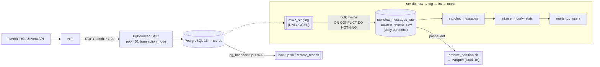

# Zevent database layer


🇬🇧 English | 🇫🇷 [Français](README.fr.md)

PostgreSQL layer only (section 2️⃣ of the architecture doc — storage,
partitioning, PgBouncer, tuning, archival). Extraction/NiFi and
monitoring/Prometheus are out of scope here.

## Table of contents

- [Architecture](#architecture)
- [Files](#files)
- [Capacity planning (Zevent 2025 baseline)](#capacity-planning-zevent-2025-baseline)
- [Scaling to absorb 10,000 TPS bursts](#scaling-to-absorb-10000-tps-bursts-2026-09-01-target-change)
- [How this was verified](#how-this-was-verified)
- [Usage](#usage)
- [Not done here (explicitly out of scope)](#not-done-here-explicitly-out-of-scope)

## Architecture



- **Ingestion**: NiFi COPYs each batch into an `UNLOGGED` staging table
  (no WAL, no indexes), then one bulk `INSERT ... SELECT ... ON CONFLICT
  DO NOTHING` merges it into the real partitioned table — see
  [Scaling to absorb 10,000 TPS bursts](#scaling-to-absorb-10000-tps-bursts-2026-09-01-target-change).
- **Transform chain**: `raw` (bronze) → `stg` → `int` → `marts`, driven
  by `stg.refresh_chat_messages()`, `int.refresh_user_hourly_stats()`,
  `marts.refresh_top_users()` (or `marts.refresh_all()` for the whole
  chain) in `schema.sql`.
- **Archival/backup**: `archive_partition.sh` exports old partitions to
  Parquet post-event; `backup.sh` + WAL archiving + `restore_test.sh`
  cover point-in-time recovery — see
  [How this was verified](#how-this-was-verified).

## Files

- `schema.sql` — raw (bronze) partitioned tables, staging/intermediate/marts
  tables, and the transform functions between them. Idempotent to re-run.
- `partitions.sql` — creates the daily partitions for the event window via
  `raw.create_daily_partitions()`. Re-runnable; skips partitions that
  already exist.
- `insert_example.sql` — the idempotent insert pattern NiFi should use.
- `pgbouncer.ini` — connection pooling config for srv-db.
- `postgresql.tuning.conf` — settings to append to postgresql.conf.
- `archive_partition.sh` — post-event: export one partition to Parquet
  (via DuckDB), verify the row count, then detach/drop it from Postgres.
- `backup.sh` — `pg_basebackup` wrapper; run once before the event and
  optionally mid-event. Works together with WAL archiving (enabled in
  `postgresql.tuning.conf`) to cover everything since the last base backup.
- `restore_test.sh` — does a real point-in-time recovery into a throwaway
  instance and diffs row counts against the live database. Run this after
  every `backup.sh` — an untested backup is not a backup strategy.
- `docker-compose.yml` — local Postgres + PgBouncer for testing the above
  before touching srv-db.
- `.env` / `.env.example` / `.gitignore` / `userlist.txt.example` —
  credentials for local testing kept out of the committed files.

## Capacity planning (Zevent 2025 baseline)

Numbers below are the real Zevent 2025 official stats (327 streams, 55h)
and are what the schema/tuning choices in this repo are sized against —
not the whole architecture doc's speculative worst cases from earlier
drafts (49.5M messages, then 25M — both were the wrong order of
magnitude once checked against real viewer numbers).

- 296,175 avg viewers / 751,889 peak (day/night cycle, ~20x peak/trough,
  ramping over tens of minutes — no sudden wall to absorb).
- At a realistic 1.5 msg/min per 100 viewers (this ratio drops on very
  large channels — chat becomes unreadable and slow-mode kicks in):
  ~74 msg/s average, ~188 msg/s peak, ~15-18M chat messages total over
  55h.
- Raw storage: ~18M messages × 250B ≈ 4.5GB, ~8.3GB with indexes.
  Including WAL, bloat, temp space, and dbt silver/gold layers, total
  footprint lands around 47GB — comfortably inside srv-db's 100GB, even
  at 2x this estimate.
- srv-db spec: 4 cores / 8GB RAM / 100GB SSD. 188 msg/s peak is well
  under what even plain multi-row `INSERT`s sustain (~5,000/s batched
  in 500s); `COPY` batches would give another 4x beyond that. Throughput
  was never going to be the constraint on this hardware — see
  `postgresql.tuning.conf` for the config sized to it.
- This is why `raw.create_daily_partitions()` (3 partitions for the
  55h window) replaced the earlier hourly scheme (55 partitions): at
  ~6M rows/partition/day, daily partitioning is still trivially
  manageable and removes partition-management overhead the volume
  never justified.
- Out of scope here (belongs to the NiFi/collector layer, section 1️⃣):
  IRC reconnect/backoff, upstream disk buffering, and Zevent-API
  checkpointing. This repo's contribution to that resilience story is
  the idempotent insert pattern (`insert_example.sql`) and the
  backup/restore chain below.

## Scaling to absorb 10,000 TPS bursts (2026-09-01 target change)

A stress test showed NiFi able to stream ~10,000 TPS while srv-db could
not keep up — roughly 50x the 188 msg/s peak the capacity planning above
was sized against. This is a real requirement the database must now
absorb without falling behind — but it's a burst-handling target, not a
new 55h sustained average (confirmed below): the original day/night
viewer-count pattern and ~47GB event footprint still hold. The changes
below make the ingestion *path* fast enough that a spike doesn't queue
up or get dropped, without over-building for a volume the event was
never going to produce.

- **Ingestion pattern changed** from "bulk batch every 10-15min" to
  "COPY-to-staging + bulk merge every ~1-2s" — see `insert_example.sql`.
  NiFi COPYs each batch into a shared `UNLOGGED` staging table
  (`raw.*_staging`, no WAL, no indexes), then one bulk
  `INSERT ... SELECT ... ON CONFLICT DO NOTHING` moves it into the real
  partitioned table in a single index-maintenance pass instead of one
  per row. All three steps run in one transaction, so a crash/timeout
  retry is a clean re-run of the same `batch_id` — normal MVCC rollback
  applies to `UNLOGGED` tables during live operation; the "truncated on
  crash recovery" property only matters for a hard server crash, and by
  then anything committed was already merged out of staging.
- **Raw-layer indexes cut from 3 to 2 per table**: dropped the
  standalone `user_id` btree (nothing queries raw by user directly —
  that's what stg/int are for) and switched `created_at` from btree to
  BRIN (near-free to maintain per insert on roughly time-ordered data;
  partition pruning already does most of the time filtering, this
  covers filtering within a partition). Every remaining index still
  costs something per row at 10k rows/s, so this wasn't optional.
- **`postgresql.tuning.conf` retuned**: `max_wal_size` (4GB→6GB) and
  `checkpoint_timeout` (15min→20min) raised modestly — capped by the
  96GB disk shared with data, not scaled up freely the way a bigger box
  could (see hardware note below); `commit_delay`/`commit_siblings`
  added for group commit, since fsync count — not query logic — becomes
  the real ceiling on commit rate during a burst of concurrent
  batch-merge transactions; `autovacuum_vacuum_insert_scale_factor`
  added because insert-only tables never trigger the delete/update-driven
  autovacuum threshold, so without it raw tables would only get vacuumed
  at wraparound-emergency thresholds instead of incrementally.
- **PgBouncer pool sizes**: `default_pool_size` 50→40→50. Each batch's
  transaction now holds its connection for a COPY + merge + delete,
  longer than the old single INSERT did, which argued for more than the
  original 50 — but on the original 7.8GB RAM spec, 40 real connections
  was already double the 20 that hit >50k rows/s in testing, and RAM
  didn't comfortably fit more than that once each connection's `work_mem`
  was accounted for. The 2026-09-02 RAM upgrade (below) removed that
  ceiling, so it's back to 50.
- **Hardware — RAM upgraded 2026-09-02**: srv-db is 4 cores / 16GB RAM /
  96GB disk. RAM was bumped from 7.8GB to 16GB (confirmed, not the
  earlier unconfirmed 8+ core/32GB/NVMe draft this section once assumed);
  cores and disk are unchanged. `postgresql.tuning.conf` and
  `pgbouncer.ini` were retuned for the extra RAM (`shared_buffers`
  2GB→4GB, `effective_cache_size` 6GB→12GB, `maintenance_work_mem`
  512MB→1GB, pool size 40→50) but `max_wal_size` stays at 6GB — that's
  capped by the shared 96GB disk, not RAM. CPU/RAM/insert-speed were
  never actually the constraint at 10k TPS on this box even before the
  upgrade (see benchmarks below); the upgrade buys cache headroom and
  connection headroom, not more insert throughput.
- **10,000 TPS is a burst-absorption requirement, not the 55h average**
  (confirmed — the day/night viewer-count pattern in the original
  capacity planning still holds; 10k TPS is what a spike must not fall
  behind on, not a new constant rate). This matters for disk: raw+index
  data at a *genuinely sustained* 10k rows/s would grow ~16.7GB/hour
  (10k/s × 250B/row × 1.85 index-overhead factor) — ~916GB unarchived
  over 55h, ~9.5x the 96GB disk. That figure doesn't apply here; average
  volume over the event stays close to the original ~47GB footprint
  estimate, so the existing post-event-only `archive_partition.sh` is
  still sufficient — no mid-event archival cadence needed. What 10k TPS
  actually requires is exactly what this section built: an ingestion
  path that doesn't degrade under a burst, which the benchmarks below
  confirm on the real hardware.

**Verified**, all on the real srv-db host (this machine's spec matched
srv-db's documented 4-core/7.8GB/96GB exactly at the time, confirmed via
`nproc`/`free`/`df` — not an unrelated dev machine; RAM has since been
upgraded to 16GB, see hardware note above) via docker-compose, though
still with default *untuned* Postgres settings since the container
doesn't load `postgresql.tuning.conf`:
- Replaying the same `batch_id` through the new 3-step pattern twice
  inserts once (`INSERT 0 2` then `INSERT 0 0` on replay) and staging
  ends at 0 rows both times — idempotency and self-cleanup both hold.
- A single COPY-to-staging + bulk-merge transaction for 50,000 rows:
  ~0.30s (~166k rows/s) vs. ~0.57s (~88k rows/s) for the equivalent
  single-statement multi-row `INSERT ... ON CONFLICT` on the same
  (already-trimmed) 2-index schema — roughly 1.9x from the COPY path
  alone, before counting the index cut or group commit.
- 20 concurrent connections replaying 40 batches of 500 rows (20,000
  rows total) via the full pattern: ~0.38s wall clock, ~52k rows/s
  sustained — comfortably over the 10k TPS *row-throughput* target, on
  the real hardware, even with tuning.conf not applied. This confirms
  insert throughput and CPU/RAM were never the bottleneck on this box —
  which is exactly why disk capacity (above) is the finding that
  matters, not further insert-path tuning.
- Not yet verified: `postgresql.tuning.conf` actually applied (group
  commit's effect specifically needs load with it active), real NiFi
  over the real Ethernet link (vs. localhost — expected to be a
  non-issue on wired LAN, but untested), and any mid-event archival
  cadence, since none exists yet.

## How this was verified

Ran end-to-end against `docker-compose.yml`:
- `schema.sql` applies cleanly (all layers, functions, indexes).
- `partitions.sql` created exactly 3 daily partitions + the 2 default
  partitions per table, and re-running it is a no-op (no duplicate
  partitions, confirmed via `NOTICE: ... already exists, skipping`).
- Replaying the same batch twice via `insert_example.sql` inserts once,
  confirming `ON CONFLICT (batch_id, row_number, created_at) DO NOTHING`
  actually prevents duplicates — **provided `created_at` is the source
  event's own timestamp, not `now()`** (see comment in that file; this
  was caught by testing, not assumed).
- Rows route to the correct daily partition by absolute time (careful:
  partition names reflect UTC, not the wall-clock offset in the insert).
- `marts.refresh_all()` correctly dedupes/filters through
  raw → stg → int → marts and produces `marts.top_users`.
- PgBouncer proxies queries through to Postgres correctly (transaction
  pool mode). Note: the `edoburu/pgbouncer` test image hardcodes its
  internal listen port to 5432 regardless of `pgbouncer.ini`'s
  `listen_port = 6432` — that's a quirk of this specific test image's
  entrypoint script, not of the delivered `pgbouncer.ini`, which srv-db
  will run directly with real PgBouncer.
- Full backup/restore chain, in a throwaway container: enabled WAL
  archiving, applied the schema, took a base backup with `backup.sh`,
  wrote more rows, then ran `restore_test.sh`, which recovers into a
  second instance and diffs row counts against the live one.
  - First attempt failed (`live=3 restored=1`) — not a script bug, a real
    gotcha: I'd combined an `INSERT` and `SELECT pg_switch_wal();` in one
    `psql -c "A; B;"` call. `psql -c` sends multi-statement strings as a
    single implicit transaction, so the switch landed the segment
    boundary between the write and its commit record — the commit record
    sat in the next, not-yet-archived segment, so the restore silently
    lost a "committed" row. Fixed by issuing them as separate statements
    (which is what real traffic does anyway — every NiFi batch commit is
    its own transaction) and documented the trap in `backup.sh` so it
    isn't rediscovered the hard way against real event data.
  - Re-ran clean: `restore_test.sh` reports `PASS`, restored row counts
    match live exactly.
  - Not re-run when partitioning switched from hourly to daily: backup/
    restore operates on the whole cluster via WAL, not per-partition, so
    partition granularity doesn't change what's being verified there.

## Usage

```bash
# 1. Apply schema
psql -d zevent -f schema.sql

# 2. Create partitions for the event window
psql -d zevent -v start_ts="'2026-09-04 18:00:00+02'" -v hours=55 -f partitions.sql

# 3. (NiFi inserts batches using the pattern in insert_example.sql)

# 4. Post-event: run the transform chain
psql -d zevent -c "SELECT * FROM marts.refresh_all();"

# 5. Post-event: archive old partitions
./archive_partition.sh raw.chat_messages_raw_2026_09_04 /archive

# Backup/restore, run throughout:
./backup.sh /archive                       # before the event, and optionally mid-event
./restore_test.sh /archive/base/<stamp>     # after every backup — verifies it actually restores
```

## Not done here (explicitly out of scope)

- NiFi ingestion flow (section 1️⃣).
- Prometheus/Grafana/Alertmanager (section 3️⃣).
- `pg_exporter` install/config — the doc lists it for srv-db but it's a
  monitoring concern, not database schema/storage.
- Streaming replication to srv-monitoring — noted as optional in the doc;
  add only if actually needed, not speculatively.
